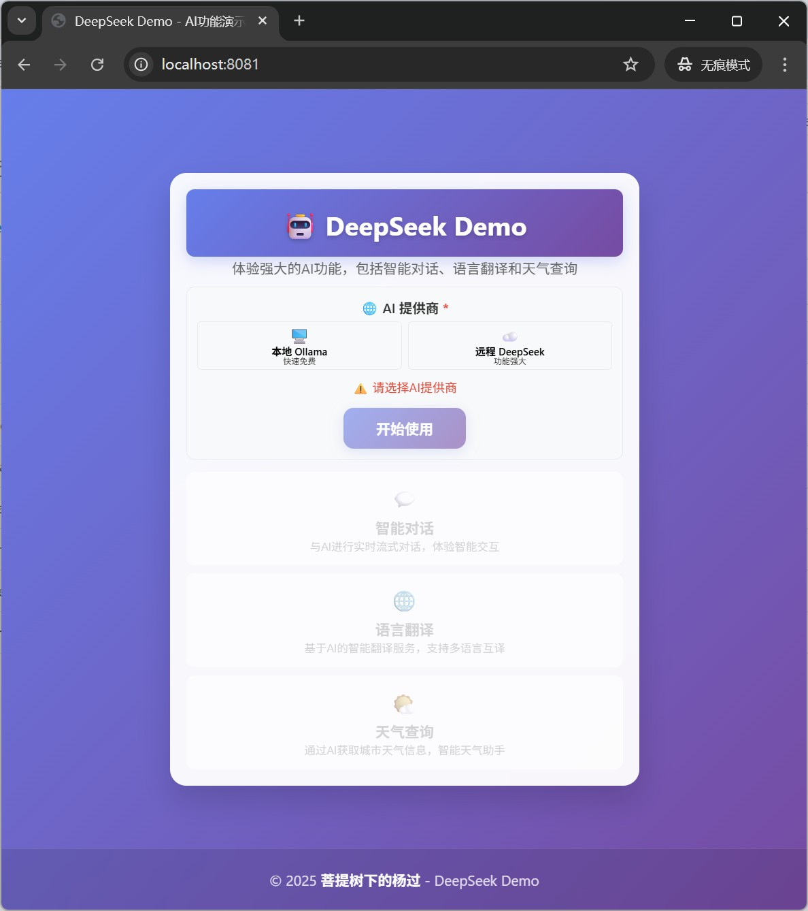
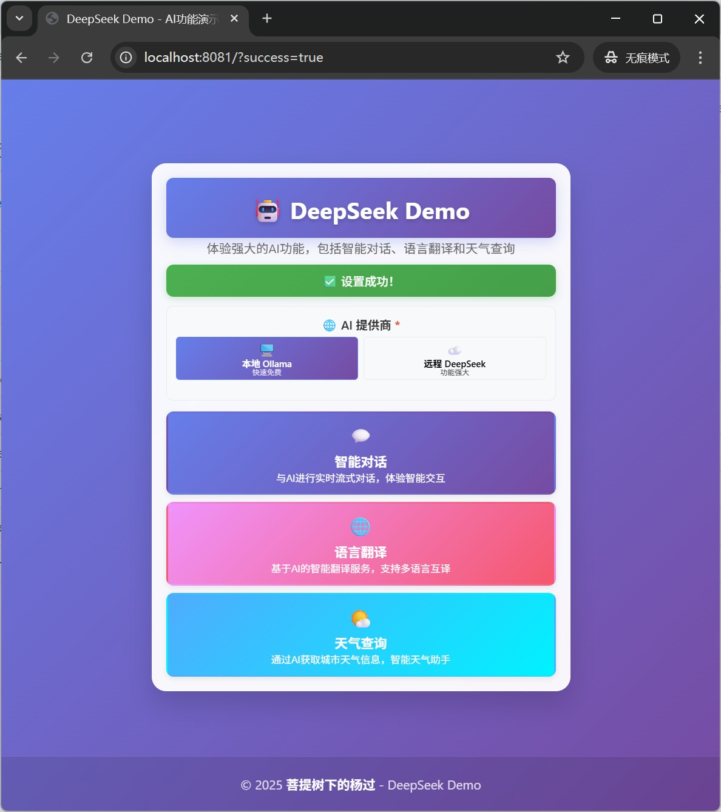
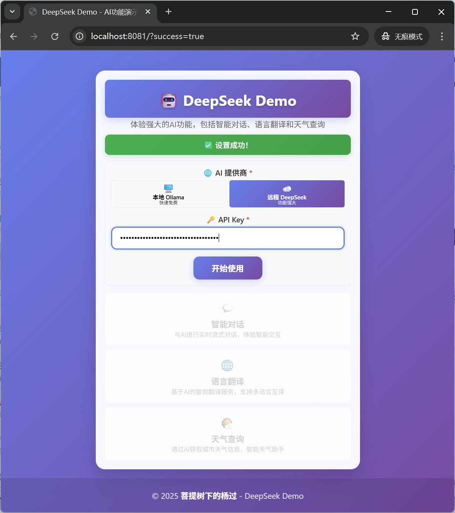
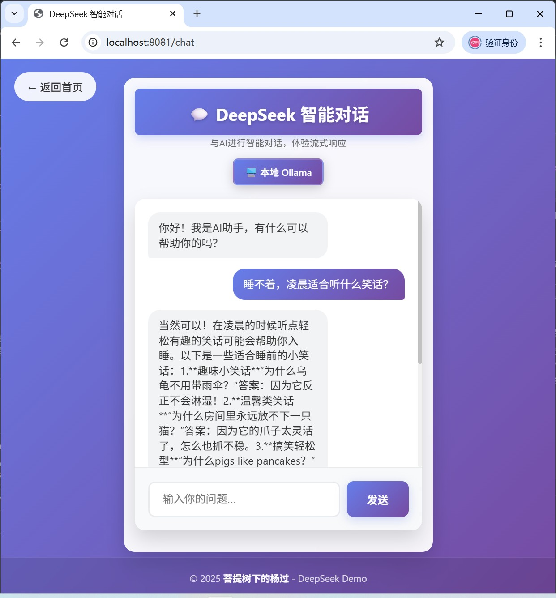
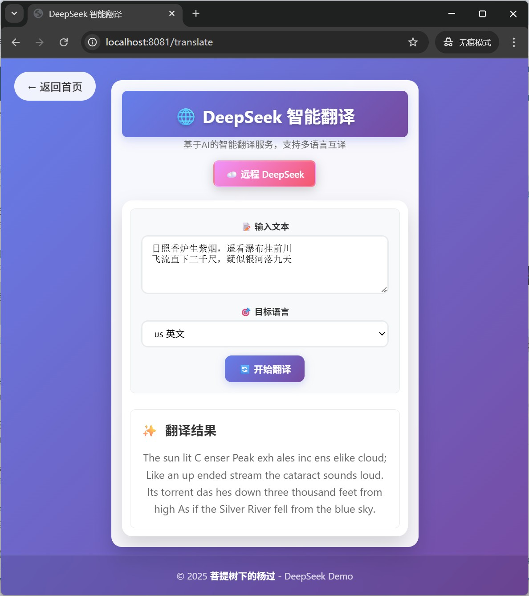
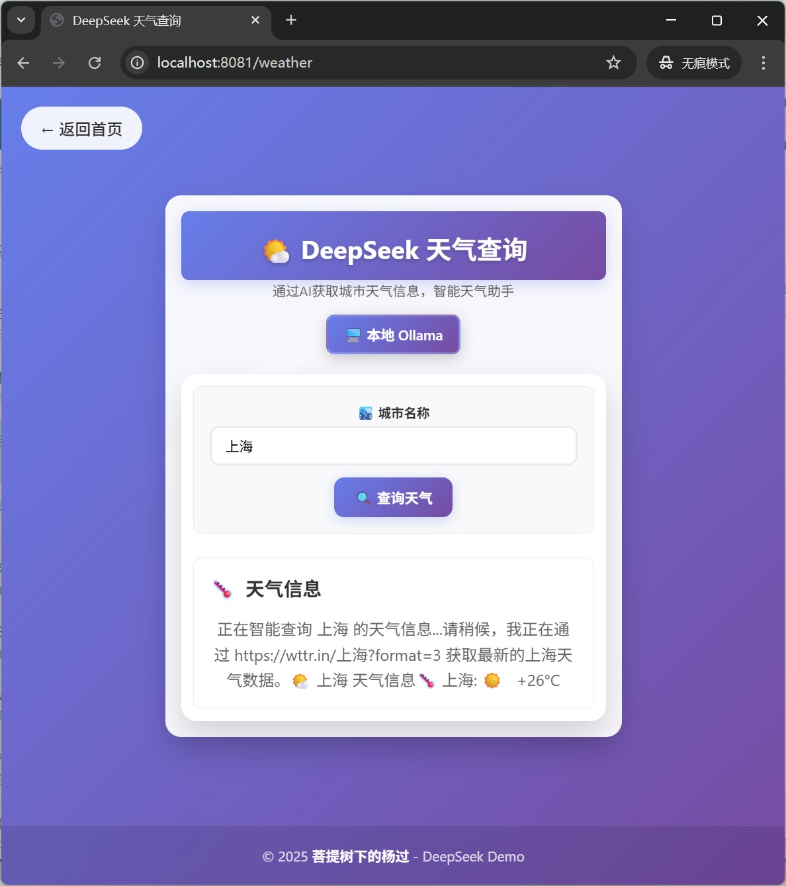
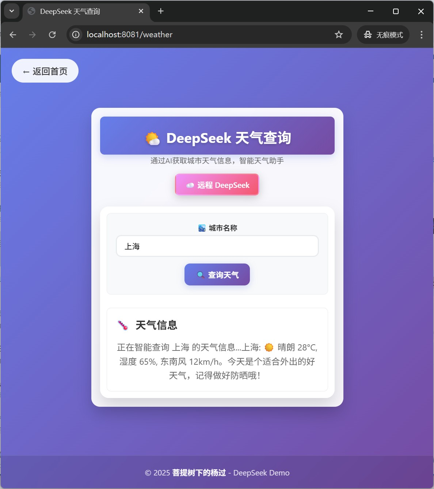

# DeepSeek Demo - AI功能演示项目

[](https://github.com/yjmyzz/deepseek-demo)
[](https://openjdk.org/)
[](https://spring.io/projects/spring-boot)
[](LICENSE)

一个基于Spring Boot的现代化AI功能演示项目，支持智能对话、语言翻译和天气查询功能。本项目展示了如何集成多种AI服务，提供流畅的用户体验。

**🌐 GitHub地址**: [https://github.com/yjmyzz/deepseek-demo](https://github.com/yjmyzz/deepseek-demo)

## 🎯 项目特色

- **🤖 双AI支持**: 同时支持本地Ollama和远程DeepSeek两种AI提供商
- **⚡ 流式交互**: 实时流式输出，提供类似ChatGPT的对话体验
- **🎨 现代化UI**: 美观的响应式界面，支持毛玻璃效果和流畅动画
- **🔧 高度可配置**: 通过配置文件轻松管理AI服务参数
- **📱 移动友好**: 完美适配桌面和移动设备
- **🚀 开箱即用**: 简单配置即可快速体验AI功能
- **🧪 完整测试**: 包含单元测试，确保代码质量

## 🚀 功能特性

### 智能对话 💬
- 实时流式对话，支持长文本输出
- 智能过滤AI思考过程（`<think>`标签）
- 支持上下文对话
- 优雅的打字机效果
- 智能空格处理，避免单词连写


### 语言翻译 🌐
- 支持中英文双向翻译
- 智能处理相同语言的情况（直接返回原文）
- 流式翻译输出
- 准确的翻译结果
- 真实API调用，非Mock数据

### 天气查询 🌤️
- 基于真实API的天气信息查询
- 集成wttr.in服务，支持全球城市查询
- 流式天气信息输出
- 友好的信息展示


### 双AI提供商 🔄
- **本地Ollama**: 快速、免费、隐私安全，支持离线使用
- **远程DeepSeek**: 功能强大、模型最新，支持更多高级功能
- 智能API Key验证
- 实时表单验证


## 📸 运行效果图

### 首页界面



### 选择AI供应商


### API Key设置


### 智能对话 - 本地Ollama


### 语言翻译


### 天气查询




## 🛠️ 技术栈

### 后端技术
- **Spring Boot 3.1.9**: 现代化的Java Web框架
- **Spring WebFlux**: 响应式编程，支持流式处理
- **Thymeleaf**: 服务端模板引擎
- **Lombok**: 简化Java代码，减少样板代码
- **Jackson**: JSON数据处理
- **Mockito**: 单元测试框架

### 前端技术
- **HTML5 + CSS3**: 现代化Web标准
- **JavaScript (ES6+)**: 原生JavaScript，无框架依赖
- **Server-Sent Events (SSE)**: 实现流式数据推送
- **响应式设计**: 完美适配各种设备
- **通用AI流式处理库**: 抽象公共逻辑，提高代码复用性

### AI服务
- **Ollama**: 本地AI服务，支持多种模型
- **DeepSeek API**: 云端AI服务，功能强大
- **wttr.in**: 天气信息API服务

### 开发工具
- **Maven**: 项目构建和依赖管理
- **Java 21**: 最新的LTS版本
- **Spring Boot DevTools**: 开发时热重载

## 📋 系统要求

- **Java**: 21+ (推荐使用最新LTS版本)
- **Maven**: 3.6+ 
- **内存**: 至少4GB RAM
- **存储**: 至少2GB可用空间
- **网络**: 用于下载依赖和访问远程AI服务

### 可选要求
- **Ollama**: 用于本地AI服务（推荐安装）

## 🚀 快速开始

### 1. 克隆项目

```bash
git clone https://github.com/yjmyzz/deepseek-demo.git
cd deepseek-demo
```

### 2. 编译运行

```bash
# 清理并编译
mvn clean compile

# 启动应用
mvn spring-boot:run
```

### 3. 访问应用

打开浏览器访问: http://localhost:8081

## 🔧 配置说明

### 应用配置 (`application.yml`)

```yaml
server:
  port: 8081

ai:
  ollama:
    base-url: http://localhost:11434
    api-path: /api/chat
    model: deepseek-r1:7b
    timeout: 30000
  deepseek:
    base-url: https://api.deepseek.com
    api-path: /v1/chat/completions
    model: deepseek-chat
    timeout: 30000
  weather:
    base-url: https://wttr.in
    timeout: 10000
```

### 本地Ollama配置 (推荐)

1. **安装Ollama**
   ```bash
   # Windows (使用WSL2)
   curl -fsSL https://ollama.ai/install.sh | sh
   
   # macOS
   brew install ollama
   
   # Linux
   curl -fsSL https://ollama.ai/install.sh | sh
   ```

2. **下载DeepSeek模型**
   ```bash
   ollama pull deepseek-r1:7b
   ```

3. **启动Ollama服务**
   ```bash
   ollama serve
   ```

4. **在应用中选择本地Ollama**
   - 访问首页
   - 选择"本地 Ollama"选项
   - 无需输入API Key
   - 点击"开始使用"

### 远程DeepSeek配置

1. **获取API Key**
   - 访问 [DeepSeek官网](https://platform.deepseek.com)
   - 注册账号并获取API Key

2. **在应用中配置**
   - 访问首页
   - 选择"远程 DeepSeek"选项
   - 输入你的API Key
   - 点击"开始使用"

## 📱 使用指南

### 智能对话

1. 点击首页的"智能对话"卡片
2. 在聊天界面输入你的问题
3. 按Enter键或点击发送按钮
4. 享受AI的流式回复

**特色功能**:
- 实时流式输出
- 智能过滤思考过程
- 支持长文本对话
- 优雅的动画效果
- 智能空格处理

### 语言翻译

1. 点击首页的"语言翻译"卡片
2. 选择源语言和目标语言
3. 输入要翻译的文本
4. 点击翻译按钮

**特色功能**:
- 智能处理相同语言
- 流式翻译输出
- 准确的翻译结果
- 支持专业术语
- 真实API调用

### 天气查询

1. 点击首页的"天气查询"卡片
2. 输入城市名称
3. 点击查询按钮

**特色功能**:
- 真实天气API调用
- 流式信息输出
- 全球城市支持
- 友好的信息展示

## 🏗️ 项目结构

```
deepseek-demo/
├── src/
│   ├── main/
│   │   ├── java/com/example/deepseek/
│   │   │   ├── config/
│   │   │   │   └── AiConfig.java              # AI服务配置类
│   │   │   ├── controller/
│   │   │   │   ├── ApiKeyController.java      # API Key管理控制器
│   │   │   │   ├── ChatController.java        # 聊天功能控制器
│   │   │   │   ├── HomeController.java        # 首页控制器
│   │   │   │   ├── TranslateController.java   # 翻译功能控制器
│   │   │   │   └── WeatherController.java     # 天气查询控制器
│   │   │   ├── service/
│   │   │   │   ├── BaseAiService.java         # AI服务基类
│   │   │   │   ├── ChatService.java           # 聊天服务
│   │   │   │   ├── TranslateService.java      # 翻译服务
│   │   │   │   └── WeatherService.java        # 天气查询服务
│   │   │   └── DeepseekDemoApplication.java   # 应用启动类
│   │   └── resources/
│   │       ├── static/
│   │       │   ├── css/
│   │       │   │   └── style.css              # 样式文件
│   │       │   └── js/
│   │       │       ├── ai-stream.js           # 通用AI流式处理库
│   │       │       └── README.md              # 前端库说明
│   │       ├── templates/
│   │       │   ├── chat.html                  # 聊天页面
│   │       │   ├── index.html                 # 首页
│   │       │   ├── translate.html             # 翻译页面
│   │       │   └── weather.html               # 天气查询页面
│   │       ├── application.yml                # 应用配置文件
│   │       └── banner.txt                     # 启动横幅
│   └── test/
│       └── java/com/example/deepseek/
│           ├── config/
│           │   └── AiConfigTest.java          # 配置类测试
│           ├── controller/
│           │   ├── ChatControllerTest.java    # 聊天控制器测试
│           │   ├── TranslateControllerTest.java # 翻译控制器测试
│           │   └── WeatherControllerTest.java # 天气控制器测试
│           └── service/
│               ├── BaseAiServiceTest.java     # AI服务基类测试
│               ├── ChatServiceTest.java       # 聊天服务测试
│               ├── TranslateServiceTest.java  # 翻译服务测试
│               └── WeatherServiceTest.java    # 天气服务测试
├── images/                                    # 项目截图
├── pom.xml                                    # Maven配置
├── README.md                                  # 项目说明
└── .gitignore                                 # Git忽略文件
```

## 🧪 测试

项目包含完整的单元测试，使用Mockito框架：

```bash
# 运行所有测试
mvn test

# 运行特定测试类
mvn test -Dtest=ChatServiceTest

# 生成测试报告
mvn surefire-report:report
```

### 测试覆盖范围

- **配置类测试**: 验证AI服务配置的正确性
- **控制器测试**: 测试API端点的响应和错误处理
- **服务层测试**: 验证业务逻辑和AI服务集成
- **Mock测试**: 使用Mockito模拟外部依赖

## 🔧 开发指南

### 代码规范

- 使用Lombok简化代码
- 遵循Spring Boot最佳实践
- 使用构造函数注入
- 保持代码简洁可读

### 前端开发

- 使用原生JavaScript，无框架依赖
- 通用AI流式处理库位于 `src/main/resources/static/js/ai-stream.js`
- 响应式设计，支持移动端
- 统一的UI风格

### 后端开发

- 基于Spring Boot 3.x
- 使用WebFlux支持流式处理
- 配置化管理AI服务参数
- 完整的错误处理

## 🎨 界面特色

### 设计理念
- **现代化**: 采用最新的Web设计趋势
- **简洁性**: 清晰的视觉层次和直观的操作流程
- **一致性**: 统一的设计语言和交互模式

### 视觉效果
- **渐变背景**: 动态渐变色彩，营造科技感
- **毛玻璃效果**: 现代化的半透明效果
- **流畅动画**: 丰富的交互动画和过渡效果
- **响应式布局**: 完美适配各种屏幕尺寸

### 用户体验
- **直观操作**: 简洁明了的用户界面
- **即时反馈**: 实时的操作反馈和状态提示
- **错误处理**: 友好的错误提示和恢复机制

## 🌟 核心特性详解

### 双AI提供商架构

项目采用策略模式实现双AI提供商支持：

```java
// 基类定义统一接口
public abstract class BaseAiService {
    protected void executeStreamRequest(String prompt, HttpSession session, 
                                      SseEmitter emitter, String provider, String requestType) {
        if ("ollama".equals(provider)) {
            executeOllamaStreamRequest(prompt, emitter, requestType);
        } else {
            executeDeepSeekStreamRequest(prompt, session, emitter, requestType);
        }
    }
}
```

### 流式处理机制

使用Server-Sent Events (SSE)实现流式输出：

```javascript
const eventSource = new EventSource(`/chat/stream?message=${encodeURIComponent(message)}`);
eventSource.onmessage = function(event) {
    appendMessage(event.data);
};
```

### 配置化管理

通过`@ConfigurationProperties`实现配置的自动绑定：

```java
@Data
@Component
@ConfigurationProperties(prefix = "ai")
public class AiConfig {
    private OllamaConfig ollama;
    private DeepSeekConfig deepseek;
    private WeatherConfig weather;
}
```

## 🎯 前端架构

### AI流式处理通用库

项目使用自研的 `ai-stream.js` 通用库来抽象Ollama和DeepSeek的流式处理逻辑：

#### 核心特性
- **统一API**: 为聊天、翻译等功能提供统一的流式处理接口
- **高度可配置**: 支持自定义端点、UI元素、按钮文本等
- **智能空格处理**: 自动处理英文单词间的空格问题
- **自动状态管理**: 自动管理UI状态（按钮禁用/启用、状态显示等）
- **完善错误处理**: 包含超时机制和错误恢复

#### 使用示例

```javascript
// 创建聊天处理器
const chatHandler = new AIStreamHandler({
    endpoint: '/chat/stream',
    messageParam: 'message',
    sendButton: document.getElementById('sendBtn'),
    statusElement: document.getElementById('status'),
    enableMessageCounter: true,
    
    onMessage: function(data, handler) {
        const messageId = handler.getCurrentMessageId();
        const aiResponse = document.getElementById(messageId);
        if (aiResponse) {
            aiResponse.innerHTML += data;
        }
    }
});

// 开始流式对话
chatHandler.startStream({ message: '你好' });
```

详细的使用指南请参考：`src/main/resources/static/js/README.md`

## 🐛 故障排除

### 常见问题

1. **Ollama连接失败**
   ```
   错误: Ollama API 错误: 404 Not Found
   解决: 确保Ollama服务正在运行，检查端口11434
   ```

2. **端口占用**
   ```
   错误: Port 8081 was already in use
   解决: 修改application.yml中的server.port配置
   ```

3. **API Key错误**
   ```
   错误: 抱歉，请求失败，请检查API Key是否正确
   解决: 检查DeepSeek API Key是否有效
   ```

### 调试技巧

1. **查看日志**
   ```bash
   mvn spring-boot:run -Dspring-boot.run.arguments="--debug"
   ```

2. **浏览器调试**
   - 打开开发者工具
   - 查看Network标签页
   - 检查Console错误信息

3. **测试AI服务**
   ```bash
   # 测试Ollama
   curl -X POST http://localhost:11434/api/chat \
     -H "Content-Type: application/json" \
     -d '{"model":"deepseek-r1:7b","messages":[{"role":"user","content":"Hello"}]}'
   ```

## 🤝 贡献指南

欢迎贡献代码！请遵循以下步骤：

1. Fork 本项目
2. 创建特性分支 (`git checkout -b feature/AmazingFeature`)
3. 提交更改 (`git commit -m 'Add some AmazingFeature'`)
4. 推送到分支 (`git push origin feature/AmazingFeature`)
5. 开启 Pull Request

## 📞 支持渠道

- **GitHub Issues**: [提交问题](https://github.com/yjmyzz/deepseek-demo/issues)
- **博客**: [菩提树下的杨过](http://yjmyzz.cnblogs.com)
- **邮箱**: 通过GitHub联系

## 🙏 特别感谢

### Cursor AI
本项目的大部分代码由 [Cursor](https://cursor.sh/) 生成。Cursor是一个强大的AI编程助手，极大地提高了开发效率。

**感谢Cursor为这个项目提供的帮助：**
- 生成完整的Spring Boot项目结构
- 实现AI服务集成逻辑
- 设计现代化的前端界面
- 编写详细的测试代码
- 优化代码结构和性能

### 开源社区
感谢所有开源项目的贡献者，特别是：
- Spring Boot 团队
- Ollama 项目
- DeepSeek 团队
- wttr.in 服务

## 📄 许可证

本项目采用 MIT 许可证 - 查看 [LICENSE](LICENSE) 文件了解详情。

## 👨‍💻 作者

**菩提树下的杨过** - [博客](http://yjmyzz.cnblogs.com) - [GitHub](https://github.com/yjmyzz)

---

⭐ 如果这个项目对你有帮助，请给它一个星标！ 